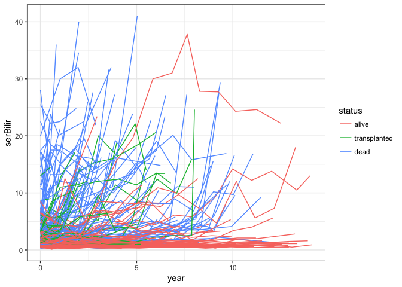
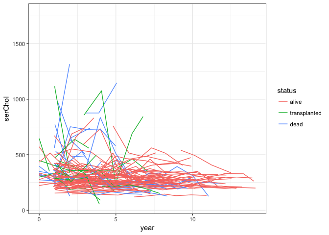
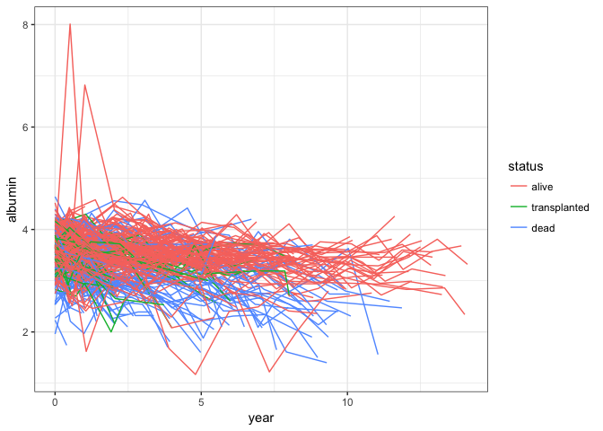
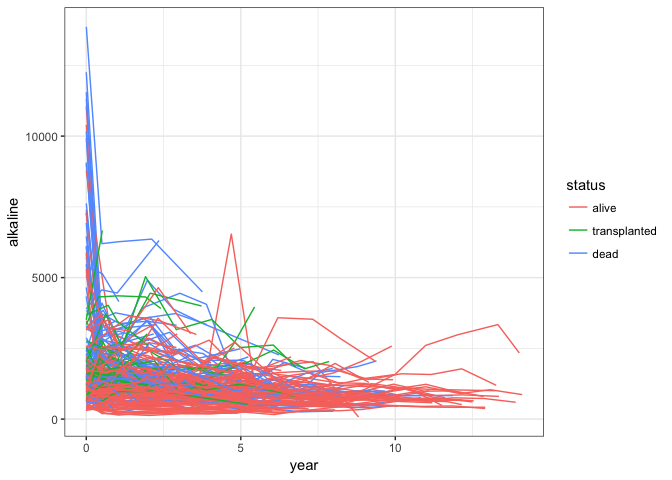
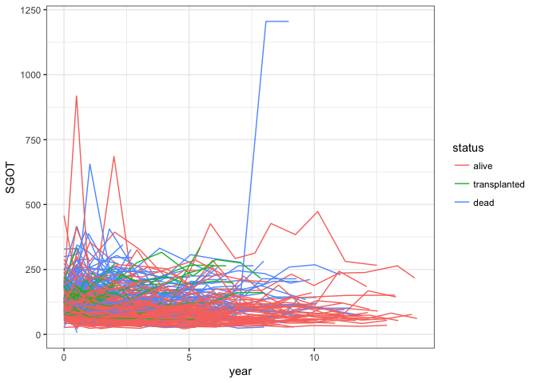
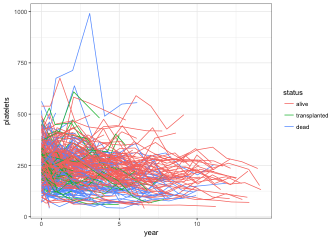
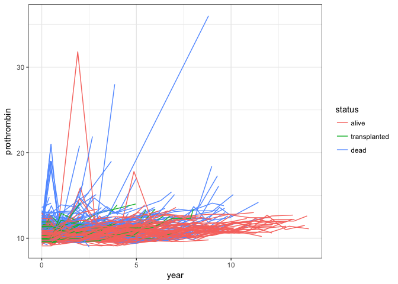

exploratory
================

R Markdown
----------

``` r
library(ggplot2)
library(joineRML)
```

    ## Warning: package 'joineRML' was built under R version 3.4.4

    ## Loading required package: nlme

    ## Loading required package: survival

``` r
data(pbc2)
theme_set(theme_bw())
names(pbc2)
```

    ##  [1] "id"           "years"        "status"       "drug"        
    ##  [5] "age"          "sex"          "year"         "ascites"     
    ##  [9] "hepatomegaly" "spiders"      "edema"        "serBilir"    
    ## [13] "serChol"      "albumin"      "alkaline"     "SGOT"        
    ## [17] "platelets"    "prothrombin"  "histologic"   "status2"

``` r
ggplot(pbc2,aes(x=year,y=serBilir,color=status,group=id))+geom_line()
```



``` r
ggplot(pbc2,aes(x=year,y=serChol,color=status,group=id))+geom_line()
```

    ## Warning: Removed 258 rows containing missing values (geom_path).



``` r
ggplot(pbc2,aes(x=year,y=albumin,color=status,group=id))+geom_line()
```



``` r
ggplot(pbc2,aes(x=year,y=alkaline,color=status,group=id))+geom_line()
```

    ## Warning: Removed 58 rows containing missing values (geom_path).



``` r
ggplot(pbc2,aes(x=year,y=SGOT,color=status,group=id))+geom_line()
```



``` r
ggplot(pbc2,aes(x=year,y=platelets,color=status,group=id))+geom_line()
```

    ## Warning: Removed 63 rows containing missing values (geom_path).



``` r
ggplot(pbc2,aes(x=year,y=prothrombin,color=status,group=id))+geom_line()
```


